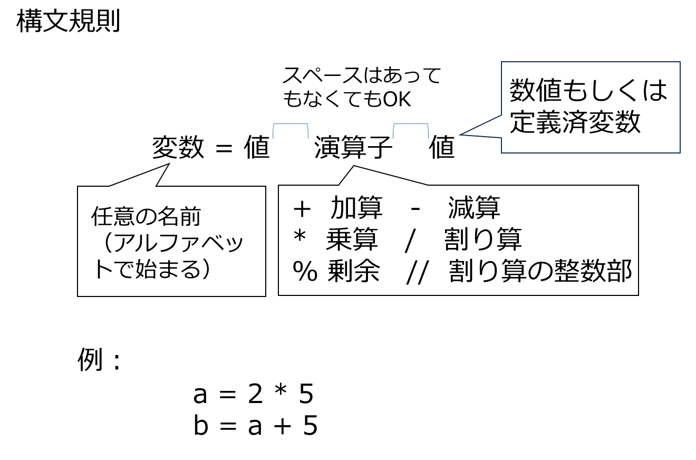
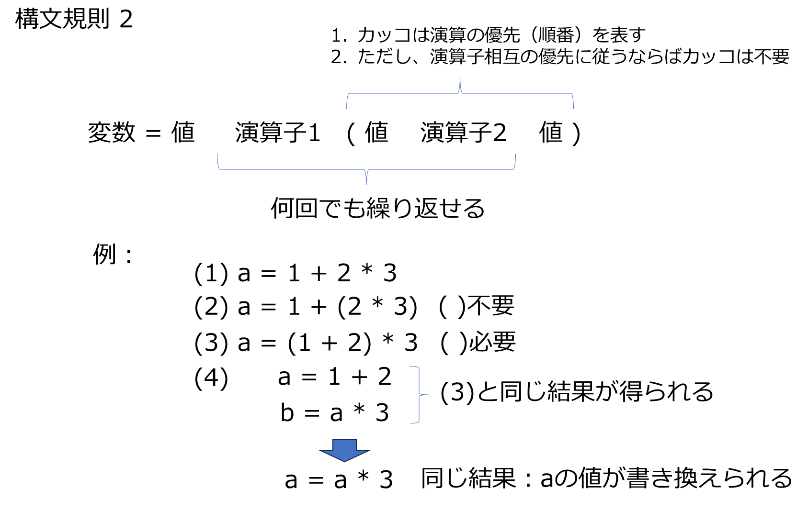

# 演算
### 1. 整数の四則演算


```python
a = 1 + 3
print(a)
b = 3*4
print(b)
c = 5/4
print(c)
d= 5//4
print(d)
e = 5%3
print(e)
```

    4
    12
    1.25
    1
    2
    


```python

```

## 演習1. 上記の演算を以下のように実数にして試してみよ
右辺の数値のどちらか一方でも実数ならば、演算結果は実数になる


```python

```

    4.0
    

### 2. べき乗


```python
a=5**2
print(a)
b=5**(-3)
print(b)
c=3**(1/2)
print(c)
d=c**2
print(d)

```

    25
    0.008
    1.7320508075688772
    2.9999999999999996
    




```python

```

## 演習2.
**1. 上記の変数について　$a*(b*10)^2$ を計算せよ**  
**2. $\frac{15}{8}$の余りを計算せよ またこの割り算の整数部を表示せよ**  
**3. $1*2*3*4*5$を計算せよ**


```python

```

    560000
    7
    1
    120
    

### 3. 演算の優先度
#### 1) 数学と同じ規則。足し算よりも掛け算、掛け算よりべき乗が優先 etc  
#### 2) 整数と実数では実数が優先


```python
a=2+3*2**2
print(a)
b=(2+3)*2**2
print(b)
c=((2+3)*2)**2
print(c)
d=1.0 + 2
print(d)
```

    14
    20
    100
    3.0
    



## 演習3. 

**1. $\frac{1}{1+2.78^{-2}}$を計算せよ**  

**2. 1,2,3,4,5の平均値$\mu$を求めよ**  

**3. 同じく分散$\sigma$を求めよ　$\sigma=\sum(x-\mu)^2$**   

**4. $2.72^{\frac{(1-\mu)^2}{2\sigma}}$を計算せよ**   

**ヒント：$2.72^x, x=\frac{a}{b}, a=(1-\mu)^2$のように分解すればよい**  

**5. $2.72^{\frac{(x-\mu)^2}{2\sigma}}$をgoogle検索窓に入力せよ**


```python


```

    0.8854314651024243
    3.0
    10.0
    1.2215571239842176
    

## データの型
1. type()はデータの型を調べる関数
2. int()は整数型への変換 float()は実数型への変換を行う関数


```python
type(2)
```


    int


```python
type(2.0)
```


    float


```python
int(2.0)
```


    2


```python
float(2)
```


    2.0


## 演習4.  
**1. 1/2のデータ型を表示せよ**  
**2. 2.5の2乗の整数部だけを取り出せ**  
**3. 1.5の2乗の整数部と上記2.の結果を加算せよ**


```python

```

    <class 'float'>
    6
    8
    


```python

```
