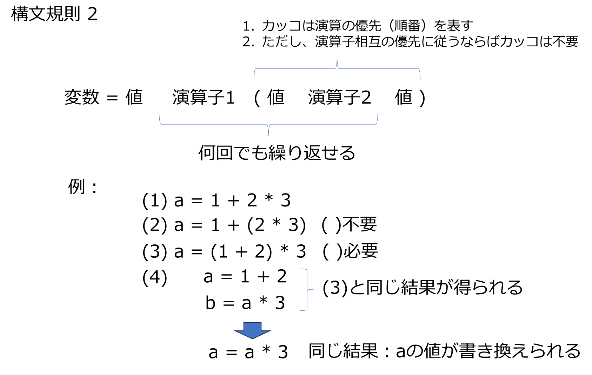

# 演算
### 1. 整数の四則演算  
以下の演算プログラミングが何を意味するのか、ひとつひとつ読み取ってみよ


```python
a = 1 + 3
print(a)
b = 3*4
print(b)
c = 5/4
print(c)
d= 5//4
print(d)
e = 5%3
print(e)
```

    4
    12
    1.25
    1
    2
    

## 実習1. 上の例にならって様々な四則演算を試してみよ
特に以下の演算が何を意味するのか右辺の数値をいろいろに変えながら考えてみよ  
インターネットで調べる習慣を身に着けよう

```python
d= 5//4
e = 5%3
```

### 2. べき乗


```python
a=5**2
print(a)
b=5**(-3)
print(b)
c=3**(1/2)
print(c)
d=c**2
print(d)

```

    25
    0.008
    1.7320508075688772
    2.9999999999999996
    

## 実習2. 上例の演算が何を意味するのか右辺の数値を変えて考えてみよ
- これらは数式にするとどのように表せるだろうか


### 3. 演算の優先度
#### 1) 数学と同じ規則。足し算よりも掛け算、掛け算よりべき乗が優先 etc  
#### 2) 整数と実数では実数が優先


```python
a=2+3*2**2
print(a)
b=(2+3)*2**2
print(b)
c=((2+3)*2)**2
print(c)
d=1.0 + 2
print(d)
```

    14
    20
    100
    3.0
    



## 実習3 上記の例にならって、各自で様々な演算の組み合わせをプログラムで書いて結果を確認せよ


```python

```

## データの型
1. type()はデータの型を調べる関数
2. int()は整数型への変換 float()は実数型への変換を行う関数


```python
type(2)
```


    int


```python
type(2.0)
```


    float


```python
int(2.0)
```


    2


```python
float(2)
```


    2.0


## 演習  

**1. 1,2,3,4,5の平均値を求めるプログラムを書け**   
**2. 1/2のデータ型を表示せよ**  
**3. 2.5の2乗の整数部だけを取り出せ**  
**3. 1.5の2乗の整数部と上記2.の結果を加算せよ**


# 変数
プログラミングにおける変数の扱い方、制約を理解してください。

## 1. 変数名の規則
##　実習
以下のa を 英数字混在する変数名に変えて試してみよ


```python
a=2+5
1a = 2+5
```


      Cell In[6], line 2
        1a = 2+5
        ^
    SyntaxError: invalid decimal literal
    


## 2.可読性
変数名に意味を持たせるとは  


1. 以下の変数a,b,c,dのいずれかのみを使って、xの4倍，xの9倍を計算するプログラムをかけ  
2. xの値を変えるとどうなるか確認せよ


```python
x=100
a=x
b=x*2
c=x*3

```

- もし、たくさんの変数を使って様々な演算をするとすれば。。
- 変数の中にどんな値がはいっているのか直感的に読み取れる（解釈できる）ような変数名にする習慣をつける


```python
x=100
single=x
double=x*2
triple=x*3

four_times=
nine_times=

```

## 3. 変数の再利用性
以下の例は、変数aを演算によって更新していくプログラムである。これに演算プログラムを追記して、aの初期値10にもどせ。ただし、演算の両辺は変数aのみを使うこと。


```python
a=8+2
print(a)
a=a**2
a=(a+a)*a
print(a)

```

    10
    20000
    

## 4. 再利用演算の省略形


```python
a=10
a=a+20
a+=20
```


```python

```
