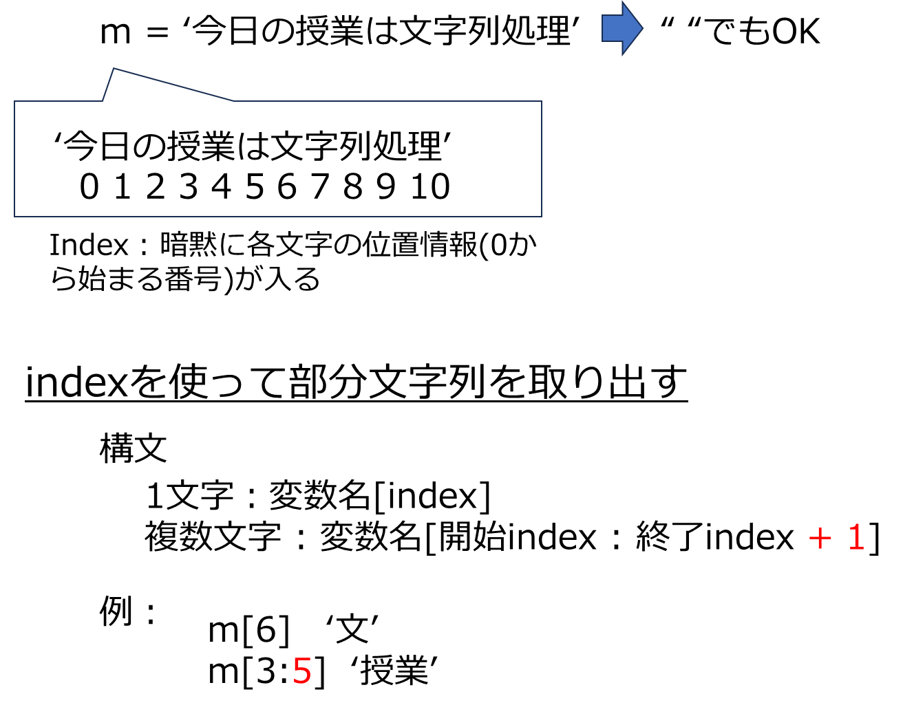

# 文字列
- 変数には数値（整数、実数）だけでなく、文字列も格納できる
- 文字列も演算の対象。ここが、数学と異なる点
- 数字を文字型として表現することもできる


### 1. 変数に文字列を格納する


```python
m = '今日の授業は文字列処理'
print(m)
m = "今日の授業は文字列処理"
print(m)
m = '今日の授業は' + '文字列処理'
print(m)
m1 = '今日の授業は'
m2 = '文字列処理'
m = m1 + m2
print(m)
m = "今日の授業は'python'文字列処理"
print(m)
m = "今日の授業は\n'python'\n文字列処理"
print(m)
m = "今日の授業は\t'python'\t文字列処理"
print(m)
```

    今日の授業は文字列処理
    今日の授業は文字列処理
    今日の授業は文字列処理
    今日の授業は文字列処理
    今日の授業は'python'文字列処理
    今日の授業は
    'python'
    文字列処理
    今日の授業は	'python'	文字列処理
    

### 2. 文字の一部を取り出す
1. 文字列の先頭を0番目とした場合の各文字の位置を指定すると、該当文字を取り出せる
2. 範囲指定もできる


```python
print(m[0])
print(m[1])
print(m[6:9])
```

    今
    日
    文字列
    



# 演習1 
1. 文字列 「プログラミングは、演習問題を繰り返し解くことで基本が身につく」 を適当な変数に格納して表示せよ
2. 上記の変数から、演習問題　を取り出して、別の変数に格納せよ
3. 同様に、基本　を取り出して、別の変数に格納せよ
4. 上記 2. 3. を演算子を使って文字列　基本演習問題　を変数に格納して表示せよ
5. 上記4. の変数から　演習　を取り出して表示せよ
6. 上記1.の例文において、”プログラミングは、”　で改行表示せよ


```python

```

    プログラミングは、演習問題を繰り返し解くことで基本が身につく
    演習問題
    基本
    基本演習問題
    演習
    プログラミングは、
     演習問題を繰り返し解くことで基本が身につく
    

### 3. 文字列型の数値


```python
a = '12345'
print(a)

```

    12345
    

**文字列型と数値型は演算できない**


```python
b = a + 5

```


    ---------------------------------------------------------------------------

    TypeError                                 Traceback (most recent call last)

    Cell In[25], line 1
    ----> 1 b = a + 5
    

    TypeError: can only concatenate str (not "int") to str


```python
**文字列型を数値型（ここでは整数型）に変換すれば演算できる**
```


```python
b = int(a) + 5
print(b)
```

    12350
    

**数値型を文字列型に変換できる**


```python
c=str(b)
print(c)
```

    12350
    


```python
c+5
```


    ---------------------------------------------------------------------------

    TypeError                                 Traceback (most recent call last)

    Cell In[29], line 1
    ----> 1 c+5
    

    TypeError: can only concatenate str (not "int") to str


# 演習2. 
1. 文字列 123 を変数に格納せよ。また、文字列 456 を別の変数に格納せよ
2. 上記の変数から文字列 123456 を作成し、整数型にして10倍した値を変数に格納せよ


```python

```

    1234560
    

### 4.文字列中の変数
**文字列の一部だけが異なる場合、いちいち全文を書き直すのは面倒**


```python
c = '今日は土曜日。天気は晴れ'
print(c)
c = '今日は日曜日。天気は雨'
print(c)
c = '今日は水曜日。天気は曇り'
print(c)
```

    今日は土曜日
    今日は日曜日
    今日は水曜日
    


```python
day = '日'
tenki = '晴れ'
c = '今日は{0}曜日。天気は{1}'.format(day,tenki)
print(c)
```

    今日は日曜日。天気は晴れ
    

### 5. 文字列の長さ


```python

```


```python
m = '今日の授業は、プログラミング基礎'
l=len(m)
print(l)
n = '12345'
print(len(n))
nn = int(n)
print(len(nn))
```

    16
    5
    


    ---------------------------------------------------------------------------

    TypeError                                 Traceback (most recent call last)

    Cell In[38], line 7
          5 print(len(n))
          6 nn = int(n)
    ----> 7 print(len(nn))
    

    TypeError: object of type 'int' has no len()


```python

```
